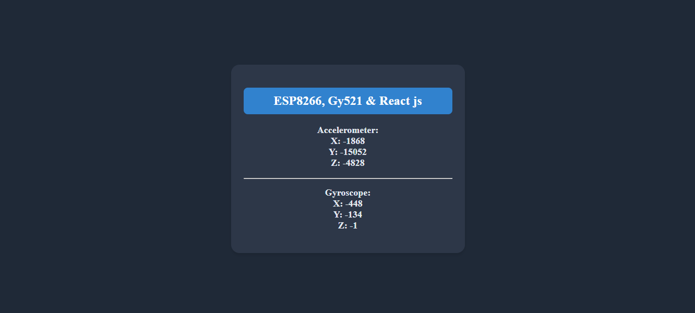

# React + NodeMCU ESP8266 + GY-521 Sensor Project

This project demonstrates real-time data fetching from a **NodeMCU ESP8266** connected to a **GY-521 (MPU6050) sensor**, and displaying the accelerometer and gyroscope values in a **React.js** frontend.

---
## **Project Structure**
```
📂 Project Root
├── 📂 Hardware_Code  (ESP8266 + GY-521 Code)
│   ├── Nodemcu_Code.ino
├── 📂 react-app       (React Frontend)
│   ├── src
│   │   ├── Gy521.js  (Fetch and Display Data)
│   ├── package.json
├── README.md         (This file)
```

---
## **1. ESP8266 Code (Nodemcu_Code.ino)**
The ESP8266 is programmed to read sensor data from the **GY-521 (MPU6050)** and serve it as a JSON API.

### **Pin Connection (GY-521 with NodeMCU ESP8266)**
| GY-521 Pin | NodeMCU Pin |
|------------|-------------|
| VCC        | 3.3V        |
| GND        | GND        |
| SCL        | D1 (GPIO5) |
| SDA        | D2 (GPIO4) |
| INT        | Not Used   |

### **Code Explanation**
- Connects to **WiFi**.
- Reads **accelerometer (ax, ay, az) and gyroscope (gx, gy, gz)** values.
- Starts a web server and serves JSON data at `http://<ESP8266-IP>/message`.

```cpp
#include <Wire.h>
#include <MPU6050.h>
#include <ESP8266WiFi.h>
#include <ESP8266WebServer.h>

const char* ssid = "Your_SSID";
const char* password = "Your_PASSWORD";
MPU6050 mpu;
ESP8266WebServer server(80);

void setup() {
    Serial.begin(115200);
    Wire.begin();
    mpu.initialize();
    WiFi.begin(ssid, password);
    while (WiFi.status() != WL_CONNECTED) { delay(1000); }
    server.on("/message", []() {
        int ax, ay, az, gx, gy, gz;
        mpu.getMotion6(&ax, &ay, &az, &gx, &gy, &gz);
        String json = "{\"ax\":" + String(ax) + ",\"ay\":" + String(ay) + ",\"az\":" + String(az) +
                      ",\"gx\":" + String(gx) + ",\"gy\":" + String(gy) + ",\"gz\":" + String(gz) + "}";
        server.send(200, "application/json", json);
    });
    server.begin();
}

void loop() {
    server.handleClient();
}
```
---
## **2. React.js Frontend**
The React frontend fetches the data from the ESP8266 server and displays it.

### **Fetching Data from ESP8266 API**
The `Gy521.js` component fetches sensor values from `http://<ESP8266-IP>/message` every second.

```js
import { useEffect, useState } from "react";

const Gy521 = () => {
    const [data, setData] = useState({ ax: 0, ay: 0, az: 0, gx: 0, gy: 0, gz: 0 });

    useEffect(() => {
        const fetchData = async () => {
            try {
                const response = await fetch("http://192.168.0.5/message");
                const result = await response.json();
                setData(result);
            } catch (error) {
                console.error("Error fetching data", error);
            }
        };
        const interval = setInterval(fetchData, 1000); // Fetch every 1 second
        return () => clearInterval(interval);
    }, []);

    return (
        <div style={{ textAlign: 'center', padding: '20px', backgroundColor: '#1F2937', color: 'white' }}>
            <h2>GY-521 Sensor Data</h2>
            <p>Accelerometer: X: {data.ax}, Y: {data.ay}, Z: {data.az}</p>
            <p>Gyroscope: X: {data.gx}, Y: {data.gy}, Z: {data.gz}</p>
        </div>
    );
};

export default Gy521;
```

### **Running the React App**
1. Open terminal and navigate to the React app folder:
   ```sh
   cd react-app
   ```
2. Install dependencies:
   ```sh
   npm install
   ```
3. Start the React development server:
   ```sh
   npm start
   ```
4. Open **http://localhost:3000/** in a browser.

---
## **3. Output Screenshot**
After running `npm start`, the output should look like this:



*(Make sure to add a screenshot of your actual output and save it as `output.png` in the repository.)*

---
## **4. Uploading to GitHub**
To push the project to GitHub, run these commands in the project root:
```sh
git add .
git commit -m "Added React and ESP8266 Code"
git push origin main
```

---
## **5. Final Notes**
- Ensure **ESP8266 and PC are on the same WiFi network**.
- Use **static IP for ESP8266** to avoid changing API URLs frequently.
- Modify **sensor data handling** if additional calculations are needed.

---
🚀 **Now, your React app successfully fetches real-time data from ESP8266!**

